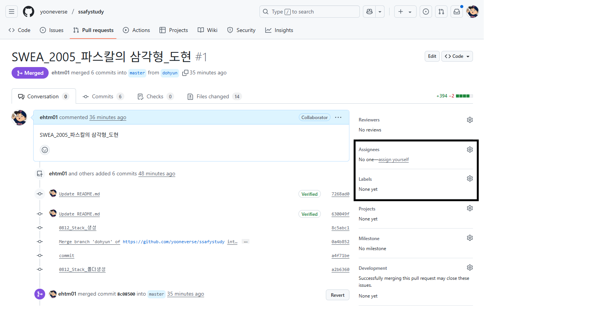
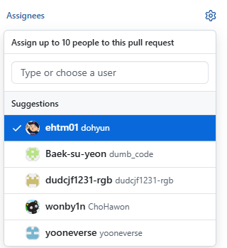
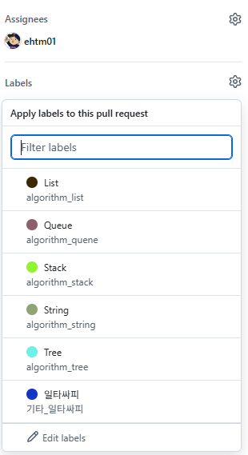
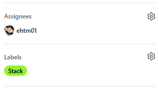
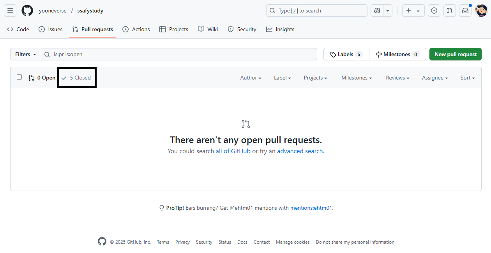
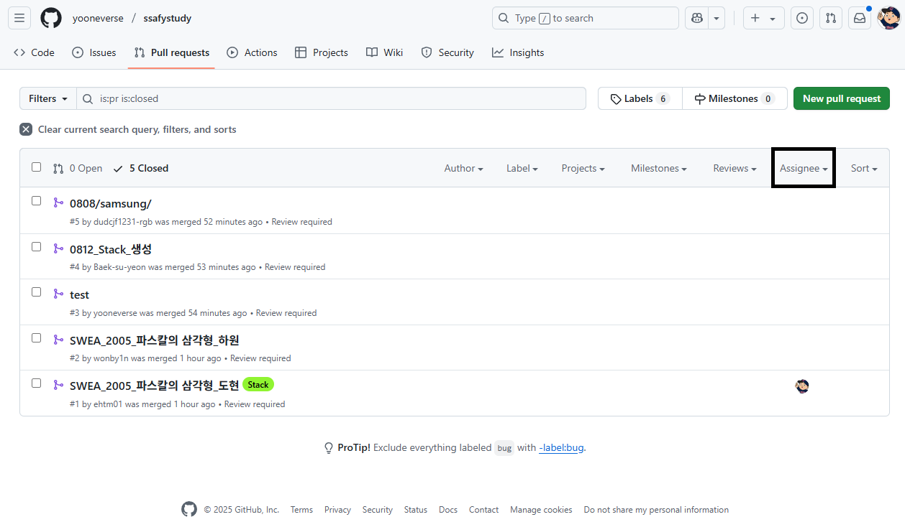
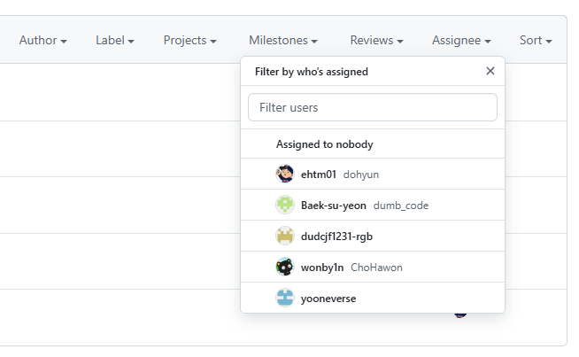
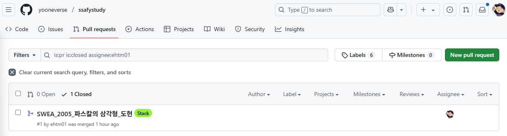

# SSAFY 14th 부울경 1반 알고리즘 스터디

- 팀장  `장영철`
- 팀원  `김승철` `김지윤` `이도현` `이동휘` `조하원`

---

## 목차

1. [스터디 진행 방식](#스터디-진행-방식)
2. [스터디 파일 양식](#스터디-파일-양식)
3. [스터디 주차별 문제](#스터디-주차별-문제)

---

## 1) 스터디 진행 방식

- 매 주 2번 13:30 ~ 14:00 진행
- [백준 그룹](https://www.acmicpc.net/group/23834)에 본인 단계에 맞는 문제 등록
- 본인의 문제 풀이는 최소 발표 전 날에 끝내도록 한다. 나머지 문제 풀이는 자유
- 하루에 3명, 발표자는 본인 문제 풀이 / 참가자는 발표한 문제 리뷰

---

 <b>PR시 해야할것</b> 

  
---
  

- `Pull Requests` 탭을 눌러 본인의 PR 등록 후 네모 박스 안의 `Assignees` 오른쪽 톱니바퀴를 누른다.
---

- 본인의 이름을 누른다.
- 또는 첫 번째 이미지에서 `assign yourself` 버튼을 눌러도 된다.
---

- 네모 박스 안의 `Labels` 오른쪽 톱니바퀴를 누른다.
---

- 적절한 Label을 선택한다.
---

- 적용된 모습

 <b>이전 PR 찾아보기</b> 

---
  

- `Pull Requests` 탭을 눌러 네모 박스 안의 `Closed` 버튼을 누른다.
---

- 네모 박스 안의 `Assignee`를 누른다.
---

- 모아 보고싶은 Assignee, 책임자(작성자)를 고른다.
---

- 책임자별로 PR했던 기록이 나오는 모습

---

## 2) 스터디 파일 양식
  
### 폴더

- 본인 브랜치가 연결된 폴더에 주차별로 week1, week2, ... 등으로 폴더 생성
- 폴더 안에 파일 넣어서 push할것
- ex) `dohyun/week1/SWEA_2005_파스칼의_삼각형`

### 업로드할 파일명 규칙

- SWEA -> SWEA
- 백준 -> BAEK
- `{문제사이트}_{문제번호}_{문제이름}.py`
- ex) `SWEA_2005_파스칼의_삼각형`

### Commit Message

- `{날짜}_{챕터}_{수정내용}`
- ex) `0812_Stack_제출`
- 혹은 `{날짜}_{문제사이트}_{문제번호}_{수정내용}`
- ex) `0825_BAEK_2839_제출`

### Pull Request

- `{문제사이트}_{문제번호}_{문제이름}_{본인이름}`
- ex) `SWEA_2005_파스칼의_삼각형_도현`

---

## 3) 스터디 주차별 문제
